# Case Study 1

## Study Overview
Spreading awareness about HIV self-testing is very important so that individuals are more likely to get tested if they are sexually active. And in the 21st century, it is imperative to use the internet, specifically websites and apps, if you want to spread the news about virtually anything. This paper's goal is to test out social media, dating apps, and information search sites to spread the news about promoting HIV self-testing. We don't know which app or site is the most effective, so the goal of this paper is to find out which medium is the most effective at promoting HIV self-testing. Specifically, they want to promote HIV self-testing to minority men who are having sex with other men at a higher risk of HIV infections.

Primary Objective: The primary objective of this paper is to compare how many HIV self-testing kits were ordered amongst users recruited using platforms such as social media, dating apps, and information search sites.

Secondary Objectives: There are multiple secondary objectives in this paper. The ones that I will be looking at in this assignment was the association of variables with ordering HIV self-test kits. The variables in particular are for:

1. Substances
2. Stage of Health Behavior Change
3. Attitudes toward HIV testing
4. Attitudes toward HIV treatment
5. HIV-related stigma among the recruited users
6. Medical Mistrust

## Replicated Table 1
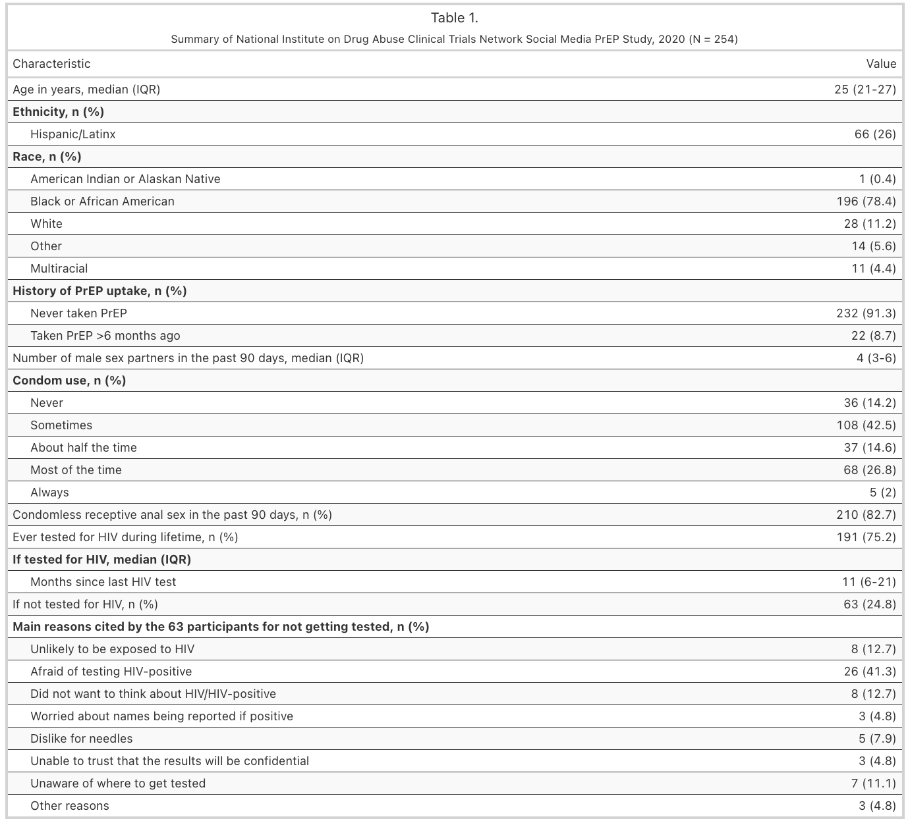

As seen from the table above, most of the numbers are the exact same as the paper's Table 1. There are a couple of minute differences, like how the interquartile range for age is 21-27 for my table while it is 23-27 in the paper's table. Any other differences is at most 0.1/0.2.

## Replicated Results

### Primary Results
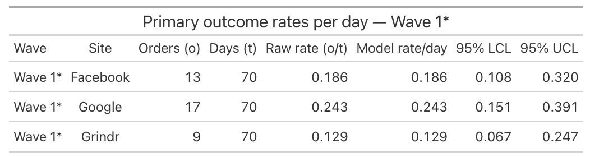
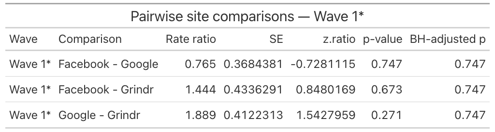
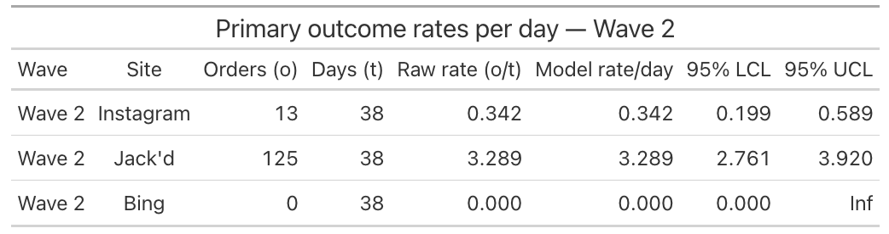
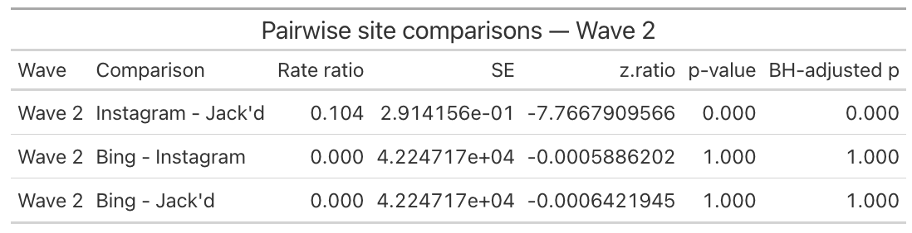

### Secondary Results
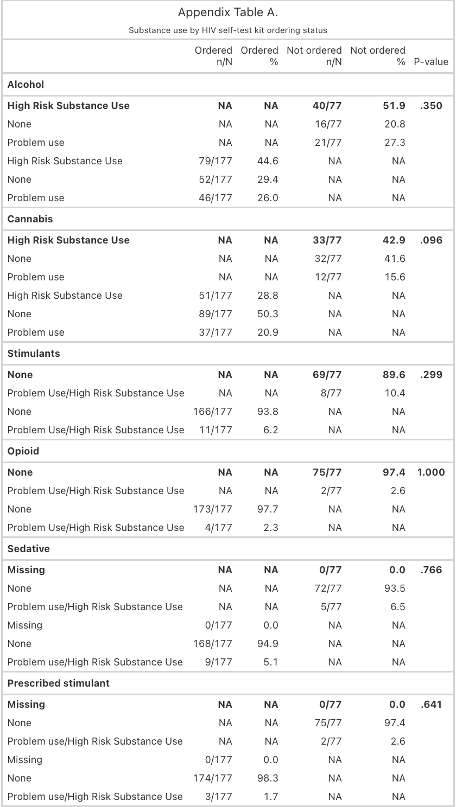
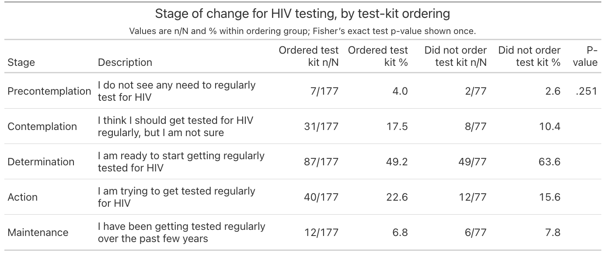
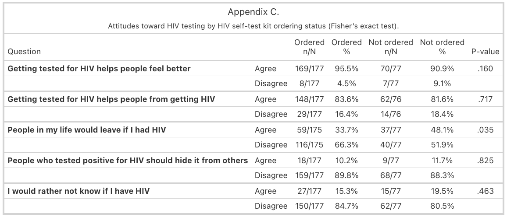
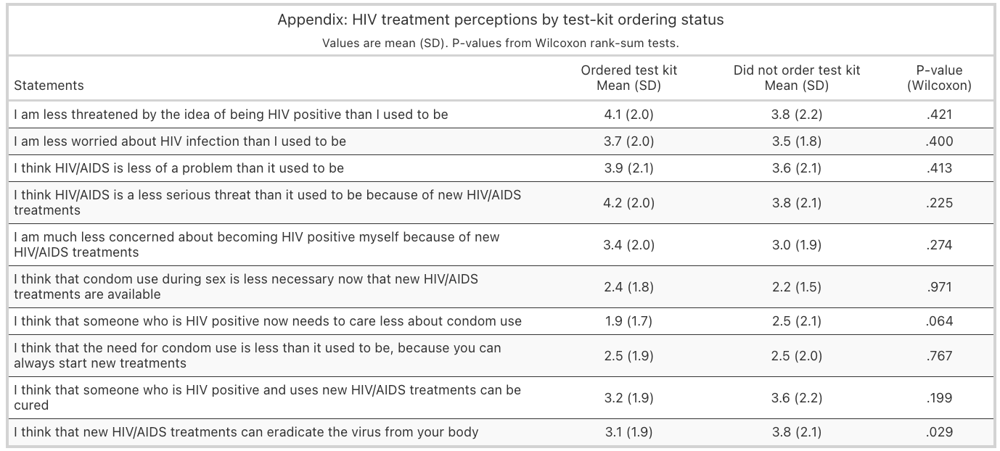
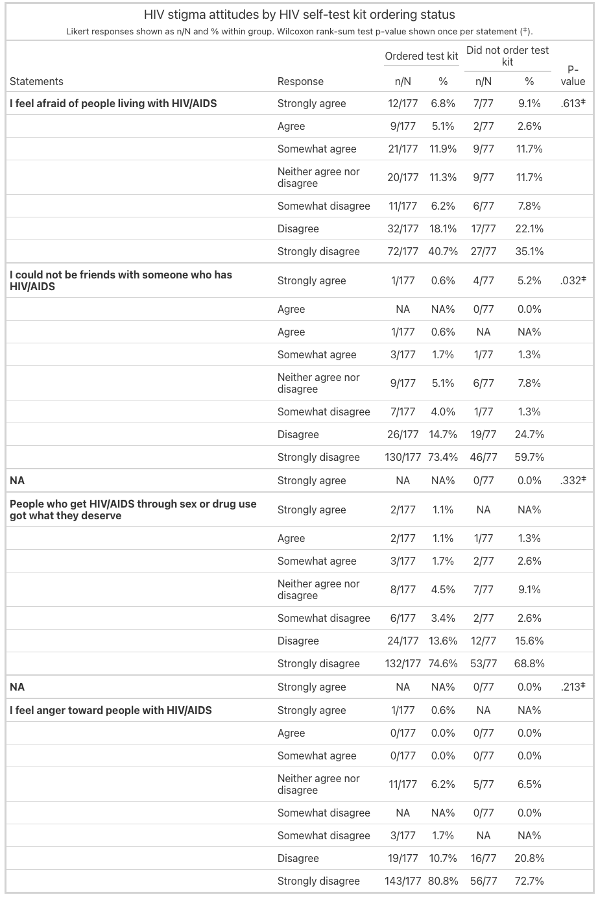
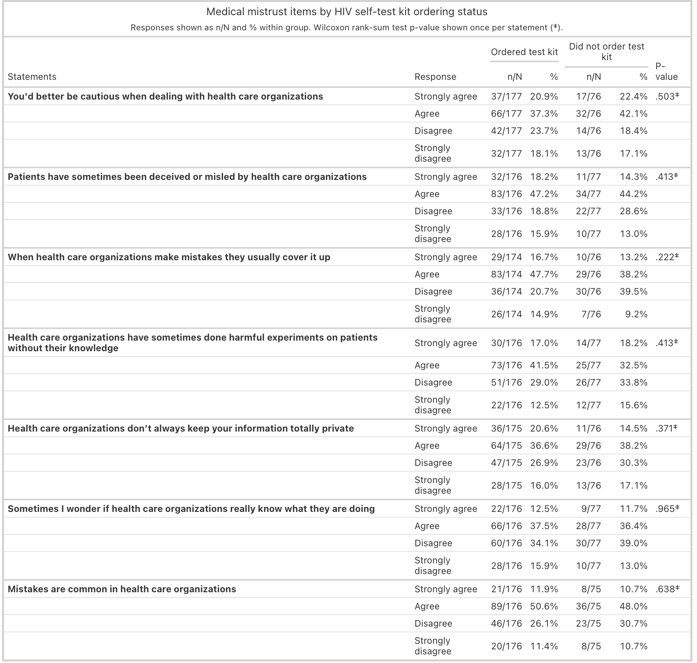

## Reflection

When attempting to replicate the paper's work, it was a bit harder than I imagined. There would be times where I would get extremely close to replicating the results, but off by a few decimal places in the p-value. I had to wonder whether that meant I was doing something wrong or if the paper gave unreplicable work. The uncertainty of whether I had actually replicated the work the best I could get.

Primary Results:

In the primary analysis I did not know how they got such a low p-value for Bing. If I were to impute a row that included Bing, then I could maybe see how they got such a low p-value. However, since there aren't any Bing entries, I'm not sure what I could do besides say that the p-value for Bing was basically 1 and statistically insignificant. That was one big change with my results and the paper's. Another difference was in the p-values I was getting for Wave 1. The paper states that they got a Hockberg-adjusted P = 0.59 in Wave 1, while the p-values I got were 0.747. Although I wasn't able to get the exact same values as the paper for the p-values, the main idea was still the same. None of the Wave 1 results were statistically significant differences across the platforms. They were all way over the 0.05 threshold. But besides my difference in results for Wave 2 Bing, my Wave 2's relationship between Jack'd and Instagram was very statistically significant, just like how the paper says.

For the actual rates themselves, I did find that Jack'd's rate was 3.29, Instagram's was 0.34, and Bing's was 0 just like how the paper says as well.

Secondary Results:

For most of the tables, I was able to get basically the exact same p-values as the ones found in the Appendix 3 document. Specifically, Table (b) - Table (f) were all reproduced exactly like the paper. Table (a) was a bit of an outlier though. I got the same p-values for Alcohol, Cannabis, Stimulants, and Opioid, but I could not get the exact same values for Sedative and Prescribed stimulant. I think it may have to be related with how the paper categorizes "Missing" for Sedative and Prescribed Stimulant. I unfortunately could not understand how they got those missing values and the p-values for Sedative and Prescribed Stimulant. The p-values I got for them weren't wildly different though, they were still relatively similar to the ones found in the paper.

## Figure
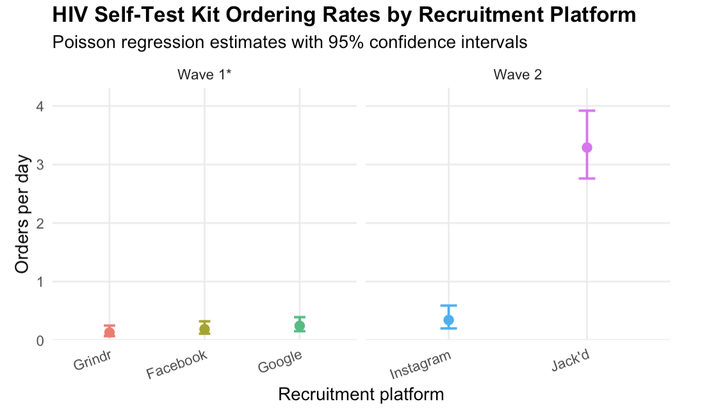

This figure puts into perspective the results of the paper. We can clearly see that Jack'd performed extraordinarily better compared to the other platforms. In this case, no other platform even came close to it.

## References

Stafylis C, Vavala G, Wang Q, McLeman B, Lemley SM, Young SD, Xie H, Matthews AG, Oden N, Revoredo L, Shmueli-Blumberg D, Hichborn EG, McKelle E, Moran LM, Jacobs P, Marsch LA, Klausner JD. Relative Effectiveness of Social Media, Dating Apps, and Information Search Sites in Promoting HIV Self-testing: Observational Cohort Study. JMIR Form Res. 2022 Sep 23;6(9):e35648. doi: 10.2196/35648. PMID: 36149729; PMCID: PMC9591705.

https://datashare.nida.nih.gov/study/nida-ctn-0083

https://cran.r-project.org/web/packages/emmeans/vignettes/comparisons.html

Also, I used ChatGPT to help me with coding. I did not use it for any narrative/written responses as per the instructions.
